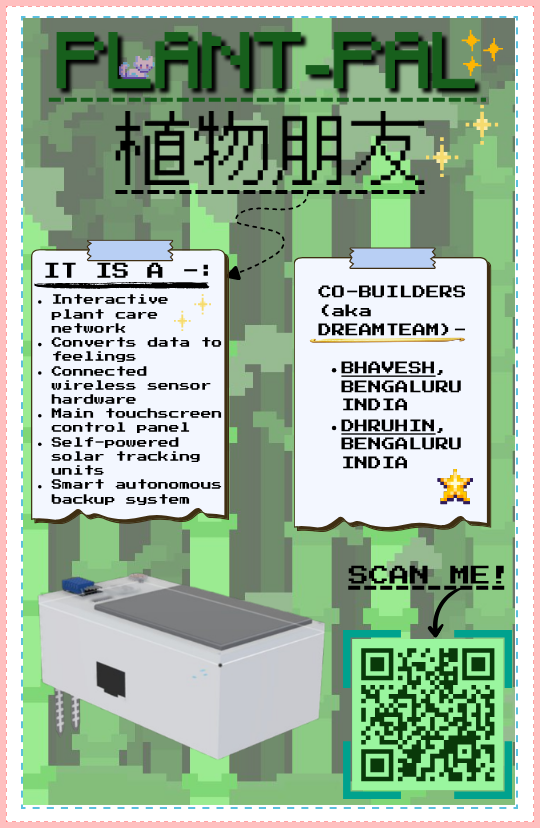

# 🌿 PlantPal

---

# NOTE

This project was originally started for FALLOUT and is now being transferred to Horizons with permission from both organizers.

No funding was received from FALLOUT, and the project was never approved there. Since FALLOUT uses Lookout, I kindly request that project hours be evaluated based on my submitted journal entries.

P.S.-PERMISSION WAS TAKEN FROM @phthallo FOR DOING IT THIS WAY.

Thank you for your consideration.

---

### Giving Plants a Voice


PlantPal is a solar-powered smart plant companion that helps people understand what their plants need. It monitors soil moisture, light intensity, temperature, and humidity, then converts that information into simple emotions displayed on a small OLED screen.

Instead of looking at graphs or sensor values, users can quickly see whether their plant is doing well, needs water, or is under stress.

---

# 🌱 Why I Made This

I've always found it interesting how plants can show signs of stress, but most people don't notice them until it's too late. Beginners often overwater plants, forget to water them, or place them in poor lighting conditions without realizing it.

I wanted to build something that could make plant care easier and more intuitive. Rather than creating another monitoring dashboard full of numbers, I decided to focus on making the plant communicate through emotions that anyone could understand at a glance.

---

# ✨ Features

* Monitors soil moisture, temperature, humidity, and light levels
* Displays plant emotions on a 0.96" OLED screen
* RGB LED provides quick status feedback
* Solar-assisted charging system
* Rechargeable 18650 battery
* Fully self-contained outdoor device
* Low-power ESP32-based design
* Custom 3D printed enclosure

---

# 🖼️ Project Gallery

## Fully Assembled Device


## Side View


## Exploded View


## Exploded View (Front)


## Exploded View (Side)


---

# 🧠 How It Works

1. The sensors continuously collect environmental data around the plant.
2. The ESP32 processes the readings and determines the plant's condition.
3. A simple health model converts the readings into an emotion.
4. The OLED screen displays that emotion.
5. The RGB LED provides quick visual feedback.
6. The solar panel helps recharge the battery during the day.

---

# 📦 CAD Files

### Complete Assembly

* [STL File](PlantPal-main/cad/BODY_WITH_ELECTRONICS/Body_electronics.stl)
* [STEP File](PlantPal-main/cad/BODY_WITH_ELECTRONICS/Body_electronics.step)

### Individual Parts

The individual enclosure components can be found in:

PlantPal-main/cad/PARTS
# ⚙️ Hardware

PlantPal is built around a low-power ESP32-based architecture designed for outdoor use. All sensing, processing, display, and power management happen inside a single enclosure, making the device completely self-contained.

## Main Components

| Component                       | Purpose                           |
| ------------------------------- | --------------------------------- |
| ESP32-WROOM-32                  | Main Controller                   |
| Capacitive Soil Moisture Sensor | Soil Moisture Monitoring          |
| AHT20                           | Temperature & Humidity Monitoring |
| BH1750                          | Light Intensity Monitoring        |
| 0.96" OLED Display              | Plant Emotion Display             |
| RGB LED                         | Visual Status Indicator           |
| 18650 Battery                   | Power Source                      |
| CN3065 Solar Charger            | Solar Charging                    |
| HT7333-A LDO Regulator          | 3.3V Regulation                   |
| 5V 2W Solar Panel               | Renewable Power Source            |
| Custom 3D Printed Enclosure     | Housing                           |

---

# 💰 Bill of Materials

| Component                       | Cost (USD) |
| ------------------------------- | ---------: |
| ESP32-WROOM-32 Dev Board        |      $4.06 |
| Capacitive Soil Moisture Sensor |      $0.65 |
| AHT20                           |      $1.34 |
| BH1750                          |      $1.42 |
| OLED Display                    |      $1.69 |
| 18650 Battery                   |      $0.73 |
| Battery Holder                  |      $0.17 |
| CN3065 Solar Charger            |      $0.88 |
| HT7333-A LDO Regulator          |      $0.48 |
| 470uF Capacitor                 |      $0.18 |
| Resistors                       |      $0.24 |
| Solar Panel                     |      $0.98 |
| Jumper Wires                    |      $1.39 |
| Heat Set Inserts                |      $0.25 |
| M3 Screws                       |      $0.28 |
| 3D Printed Enclosure            |      $3.50 |
| **Total**                       | **$18.39** |

Complete BOM:

* [Bom.csv](PlantPal-main/Bom.csv)

---

# 🔌 Wiring Diagram

PlantPal uses a custom wiring-based design built in KiCad.


The schematic includes:

* ESP32-WROOM-32
* Soil Moisture Sensor
* AHT20
* BH1750
* OLED Display
* RGB LED
* CN3065 Solar Charging Circuit
* HT7333-A Power Regulation
* 18650 Battery System

---

# 🔨 Building PlantPal

### 1. Print the Enclosure

Print the enclosure components located in:

* `PlantPal-main/cad/PRINTING PARTS`

Install the heat-set inserts after printing.

---

### 2. Prepare the Electronics

Gather all components listed in the BOM.

Install:

* ESP32
* OLED Display
* Soil Moisture Sensor
* AHT20
* BH1750
* RGB LED
* CN3065 Solar Charger
* HT7333-A Regulator
* Battery Holder

inside the enclosure.

---

### 3. Wire the Components

Using the wiring diagram above, connect all sensors and power components to the ESP32.

Pay special attention to:

* Sensor GPIO assignments
* Power distribution
* Battery connections
* Solar charging connections

---

### 4. Upload Firmware

Upload the firmware located in:

* `PlantPal-main/firmware`

using Arduino IDE or PlatformIO.

---

### 5. Final Assembly

Secure all electronics using the internal mounting points.

Route wiring through the provided channels and close the enclosure using the M3 screws.

---

### 6. Deploy

Insert the soil moisture probe into the soil and place the device where the solar panel can receive sunlight.

PlantPal will begin monitoring conditions automatically.

---

# 🚀 How To Use

Once powered on:

1. Place the moisture sensor in the soil.
2. Allow the solar panel to receive sunlight.
3. Wait for sensor readings to stabilize.
4. Read the emotion displayed on the OLED screen.
5. Use the RGB LED for quick status feedback.

The device continuously updates the plant's condition without requiring any user interaction.

---

# 📂 Repository Structure

```text
PlantPal
│
├── README.md
├── Bom.csv
├──plantpal-journal.md
│
└── PlantPal-main
    ├── cad
    ├── firmware
    ├── photos
    ├── wiring
    ├── zine
    ├── simulation

```

---

# 📰 Project Zine



PDF Version:

* [View Zine PDF](PlantPal-main/zine/ZINE_PLANT-PAL.pdf)

---

# 🔮 Future Improvements

* Mobile app integration
* Historical plant health tracking
* Additional plant profiles
* Waterproof enclosure improvements
* Smart notifications
* Better power optimization
* Expanded sensor support

---

# 🌿 Closing Thoughts

PlantPal started as an idea to make plant care easier and more approachable. Instead of expecting people to understand sensor readings and environmental data, the project focuses on translating those conditions into something intuitive.

By combining environmental sensing, solar power, and emotion-based feedback, PlantPal gives plants a simple way to communicate their needs and helps users build better habits when caring for them.
