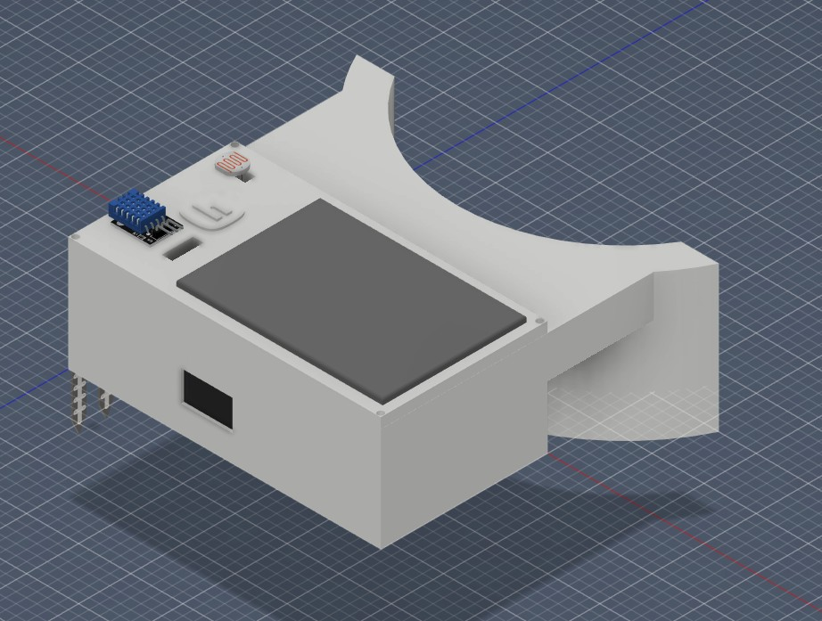
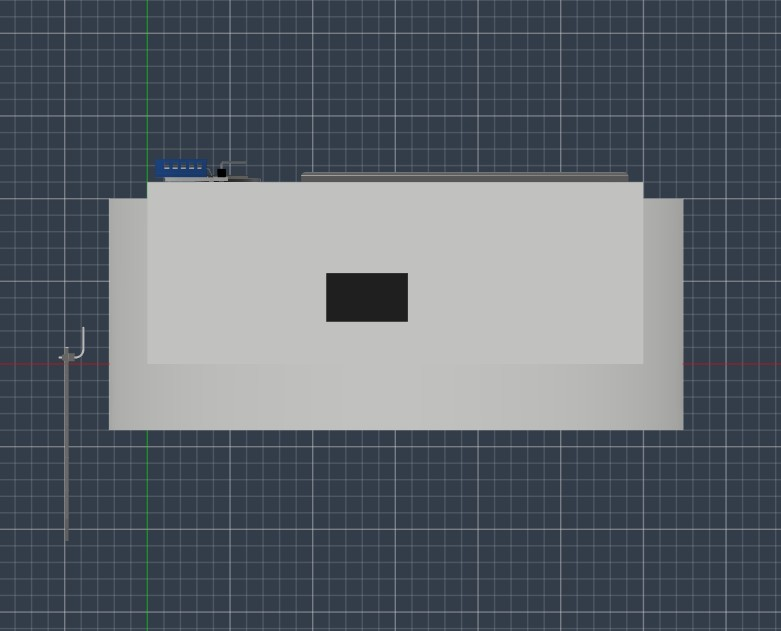
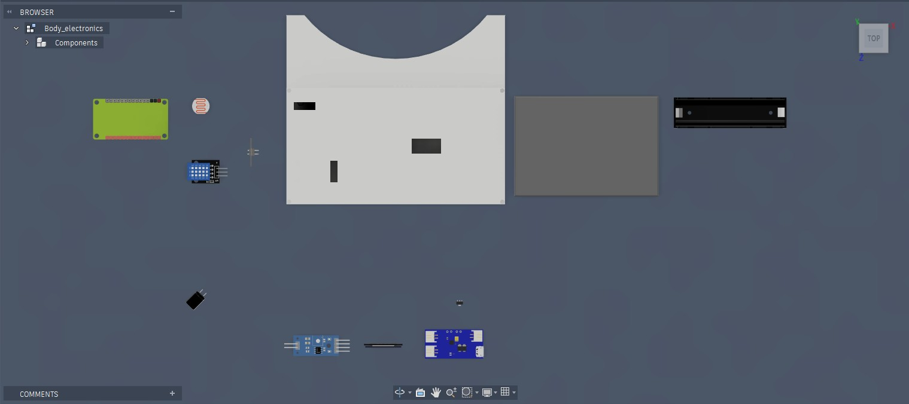
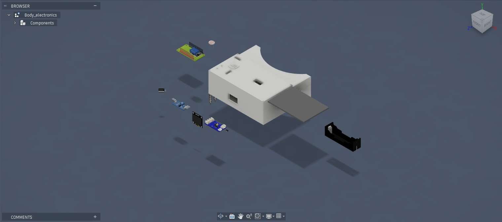
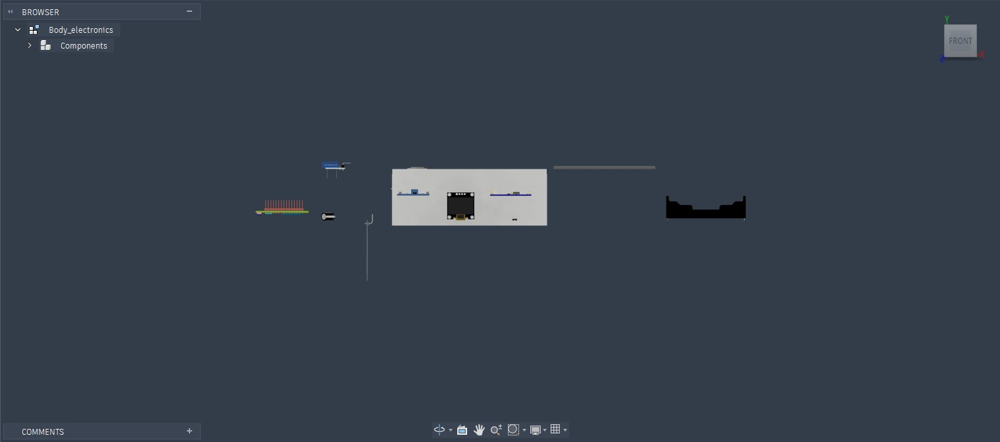
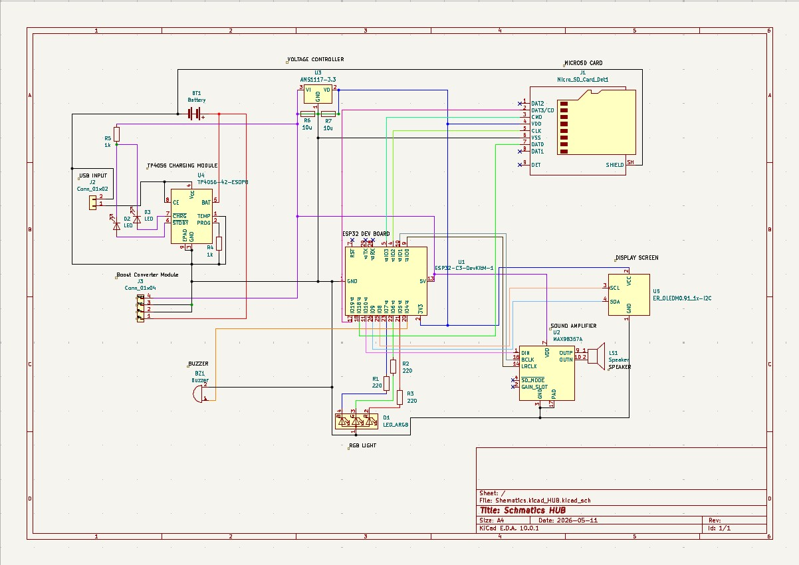

# PlantPal

---

# NOTE

This project was originally started for FALLOUT and is now being transferred to Horizons with permission from both organizers.

No funding was received from FALLOUT, and the project was never approved there. Since FALLOUT uses Lookout, I kindly request that project hours be evaluated based on my submitted journal entries.

P.S. - Permission was taken from @phthallo for doing it this way.

---

# PlantPal



PlantPal is a small solar-powered device I built to monitor the environment around a plant.

It measures soil moisture, temperature, humidity, and light levels using four sensors. Instead of showing numbers or graphs, it displays a simple face on a 0.96" OLED screen that changes depending on how the plant is doing.

The whole idea started because I thought plant monitors were a bit boring. Most of them show charts or sensor values, but I wanted something that anyone could understand in a second just by looking at it.

The device is powered by a rechargeable 18650 battery, and a small solar panel charges it during the day so it can stay beside a plant without needing constant charging.

---

# Why I Built It

I wanted a project that combined everything I enjoy building—electronics, firmware, CAD, and 3D printing.

Originally, this started as a way to learn more about embedded systems, but as I worked on it the project slowly became something much bigger. I designed the enclosure from scratch, worked out where every component should go, created the wiring, and wrote the firmware that ties everything together.

While researching similar projects, I noticed that almost all of them expected the user to understand moisture percentages or temperature readings. I thought it would be more interesting if the device translated all of that into something much simpler.

Rather than saying "the soil moisture is 28%," PlantPal simply tells you that the plant isn't happy.

---

# Features

- Measures soil moisture
- Measures temperature and humidity
- Measures ambient light
- Displays the plant's condition on a 0.96" OLED display
- RGB LED status indicator
- Rechargeable 18650 battery
- Solar-assisted charging
- ESP32-WROOM-32 based hardware
- Custom designed 3D printed enclosure

---

# Project Gallery

## Fully Assembled Device


## Side View



## Exploded View



## Exploded View (Front)



## Exploded View (Side)



The exploded renders helped me check that every component had enough space before printing the enclosure. They also made it much easier to plan the assembly order.

---

# How It Works

PlantPal reads four sensors:

- Capacitive Soil Moisture Sensor
- AHT20 Temperature Sensor
- AHT20 Humidity Sensor
- BH1750 Light Sensor

Every few seconds the ESP32 reads all of the sensors and compares the values with preset ranges inside the firmware.

Instead of displaying raw sensor readings, the firmware decides which expression best matches the current condition of the plant. Healthy conditions show a happy face, while dry soil or poor lighting changes the expression to let the user know something needs attention.

The RGB LED shows the same status, making it easy to tell how the plant is doing without even looking at the display.

Power comes from a rechargeable 18650 battery. During the day the attached solar panel recharges the battery through the CN3065 charging board so the device can keep running outdoors or on a windowsill.

---

# CAD Files

Designing the enclosure took several iterations before everything fit properly.

The battery, ESP32, charging board, display, and sensors all needed dedicated mounting locations while still leaving enough room for wiring and assembly.

## Complete Assembly

- [STL File](PlantPal-main/cad/BODY_WITH_ELECTRONICS/Body_electronics.stl)

- [STEP File](PlantPal-main/cad/BODY_WITH_ELECTRONICS/Body_electronics.step)

## Individual Parts

All printable enclosure components are available in:

```text
PlantPal-main/cad/PARTS
```

The repository also includes the source CAD files so the enclosure can be modified or improved in the future.

---

# Hardware

The electronics are built around an ESP32-WROOM-32. Everything fits inside the custom enclosure, including the battery, charging circuit, sensors, display, and wiring.

| Component | Purpose |
| ------------------------------- | --------------------------------- |
| ESP32-WROOM-32 | Main Controller |
| Capacitive Soil Moisture Sensor | Measures Soil Moisture |
| AHT20 | Measures Temperature & Humidity |
| BH1750 | Measures Ambient Light |
| 0.96" OLED Display | Displays Plant Emotion |
| RGB LED | Quick Status Indicator |
| 18650 Battery | Main Power Source |
| CN3065 Solar Charger | Charges the Battery from the Solar Panel |
| HT7333-A LDO Regulator | Provides Stable 3.3V Power |
| 5V 2W Solar Panel | Renewable Energy Source |
| Custom 3D Printed Enclosure | Holds All Components |

---

# Bill of Materials

The complete list of parts used for this project, including supplier links and prices, is available here:

- [Bom.csv](PlantPal-main/Bom.csv)

The total hardware cost is approximately **$18.39 USD**, excluding tools such as a soldering iron and the 3D printer used to manufacture the enclosure.

---
# Wiring Diagram

I didn't design a PCB for this version of PlantPal, so all of the electronics are connected using hand-wired connections.

Before assembling everything, I first recreated the circuit in KiCad. Doing this made it much easier to plan the wiring, check power connections, and avoid mistakes during assembly.



The wiring includes:

- ESP32-WROOM-32
- Capacitive Soil Moisture Sensor
- AHT20 Temperature & Humidity Sensor
- BH1750 Light Sensor
- 0.96" OLED Display
- RGB LED
- CN3065 Solar Charging Circuit
- HT7333-A Voltage Regulator
- 18650 Battery
- Solar Panel

The complete wiring diagram is included in this repository so anyone rebuilding the project can follow the exact connections.

---

# Building PlantPal

One of my goals while designing PlantPal was to make it possible for someone else to build it without having to guess how everything fits together.

This repository includes the CAD files, firmware, wiring diagram, BOM, and assembly renders that I used while building it.

---

## 1. Print the Enclosure

Print all enclosure parts from:

```text
PlantPal-main/cad/PRINTING PARTS
```

The enclosure was designed specifically around the components used in this project. Instead of making the electronics fit inside an existing box, I designed the enclosure around the battery, ESP32, display, charging board, and wiring.

After printing the parts, install the M3 brass heat-set inserts before beginning assembly.

---

## 2. Prepare the Electronics

Use the BOM as a checklist and gather all of the required parts.

Main components:

- ESP32-WROOM-32
- Capacitive Soil Moisture Sensor
- AHT20
- BH1750
- OLED Display
- RGB LED
- CN3065 Solar Charger
- HT7333-A Regulator
- 18650 Battery
- Battery Holder
- Solar Panel

Before soldering everything together, I tested each sensor individually to make sure it worked correctly. This made debugging much easier later on.

---

## 3. Assemble the Hardware

Start mounting the electronics inside the enclosure.

The enclosure includes dedicated mounting locations for:

- ESP32
- Battery Holder
- OLED Display
- Charging Board
- Voltage Regulator

I spent quite a bit of time moving components around until everything fit comfortably. The final layout also leaves enough room to route the wires neatly and reopen the enclosure later if something needs replacing.

---

## 4. Complete the Wiring

Use the wiring diagram above while soldering the connections.

The main connections are:

- I²C bus for the OLED, AHT20, and BH1750
- Soil moisture sensor signal
- RGB LED outputs
- Battery power
- Solar charging circuit
- 3.3V power distribution

Before connecting the battery, I checked every connection with a multimeter to make sure there weren't any shorts.

---

## 5. Upload the Firmware

The firmware can be found here:

```text
PlantPal-main/firmware
```

Upload it using Arduino IDE or PlatformIO.

The firmware:

- Reads all sensors
- Calculates the plant's condition
- Updates the OLED display
- Controls the RGB LED
- Repeats the process continuously while the device is running

---

## 6. Final Assembly

Once everything was tested, I closed the enclosure using the M3 screws.

The battery, charging board, regulator, ESP32, display, and wiring are all secured inside the enclosure so nothing moves around during normal use.

The assembled device should look similar to the renders shown earlier in this README.

---

## 7. Using PlantPal

Using the device is simple.

1. Insert the moisture sensor into the soil.
2. Place PlantPal next to the plant.
3. Make sure the solar panel receives sunlight during the day.
4. Turn the device on.
5. Wait a few seconds while the sensors take their first readings.

After that, everything runs automatically.

The OLED changes expression depending on the plant's condition, while the RGB LED gives a quick indication that can be seen from across the room.

There's no app to install or settings to configure. Once it's powered on, it simply keeps checking the plant and updating the display.

---
